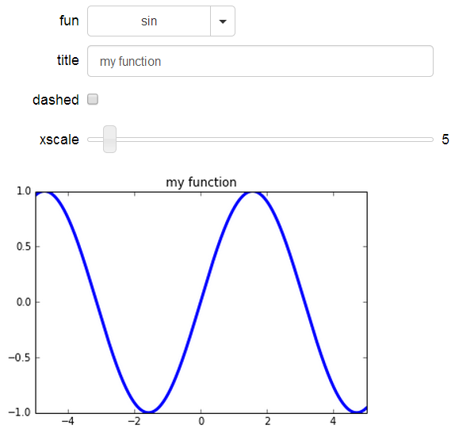
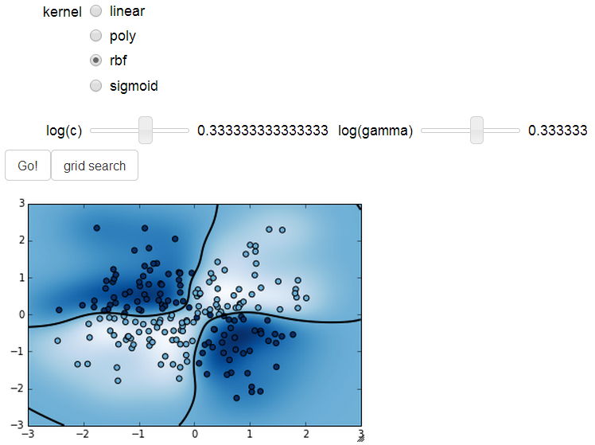

EuroSciPy 2014 IPython Advanced Tutorial
========================================

Introducing the interactive features of the IPython Notebook 2.0.

> Most of the code examples come from the [IPython Cookbook](http://ipython-books.github.io), Packt Publishing, featuring high-performance interactive computing methods for data science and mathematical modeling.

## Requirements

Simpler option is to install [Anaconda](https://store.continuum.io/cshop/anaconda/).

* Python 2.7 or Python >= 3.3
* IPython >= 2.0
* NumPy
* matplotlib
* scikit-learn (part 2)
* mpld3 (part 3, `pip install mpld3`)
* networkX (part 3, `pip install networkx`)
* a recent browser:
    * Chrome >= 13
    * Safari >= 5
    * Firefox >= 6


## Installation

```
git clone https://github.com/rossant/euroscipy2014.git
cd euroscipy2014
ipython notebook --profile=euroscipy2014
```


## Contents

In this tutorial, we illustrate different features and APIs for creating interactive widgets and visualizations in the IPython notebook.


1. [**Calling your Python functions with graphical controls**](http://nbviewer.ipython.org/github/rossant/euroscipy2014/blob/master/01_interact.ipynb).

    We show how to use the `@interact` decorator to create simple GUI controlling Python functions in real time.
    
    
    
2. [**Creating a GUI in the notebook**](http://nbviewer.ipython.org/github/rossant/euroscipy2014/blob/master/02_gui.ipynb).
    
    Elaborating on the previous example, we show how to create a more complex GUI with custom positioning, styling, and logic. The entire GUI is implemented in Python: there is no JavaScript code to write at this point.
    
    
    
3. [**Interactive data visualization in the notebook**](http://nbviewer.ipython.org/github/rossant/euroscipy2014/blob/master/03_dataviz.ipynb).

    In this part, we explore several interactive data visualization solutions in the notebook, mostly based on the **d3.js** JavaScript library. We first show how to easily make matplotlib figures interactive in the notebook with **mpld3**.
    
    Then, we introduce the *very* basics of d3.js, and we show how to render a networkX graph dynamically in the notebook. There is some JavaScript code to write here.
    
    
    
4. [**Creating a custom notebook widget with backbone.js**](http://nbviewer.ipython.org/github/rossant/euroscipy2014/blob/master/04_custom.ipynb).


## Further reading

* [Documentation of the IPython widgets](http://nbviewer.ipython.org/github/ipython/ipython/blob/master/examples/Interactive%20Widgets/Index.ipynb)
* [IPython in depth](http://nbviewer.ipython.org/github/ipython/ipython-in-depth/tree/master/examples/Interactive%20Widgets/)
* [IPython Cookbook](http://ipython-books.github.io)

